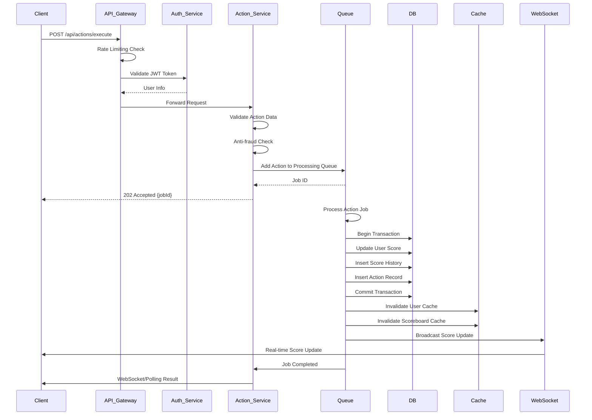
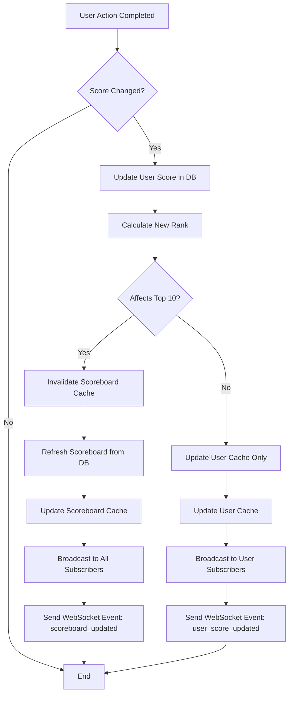
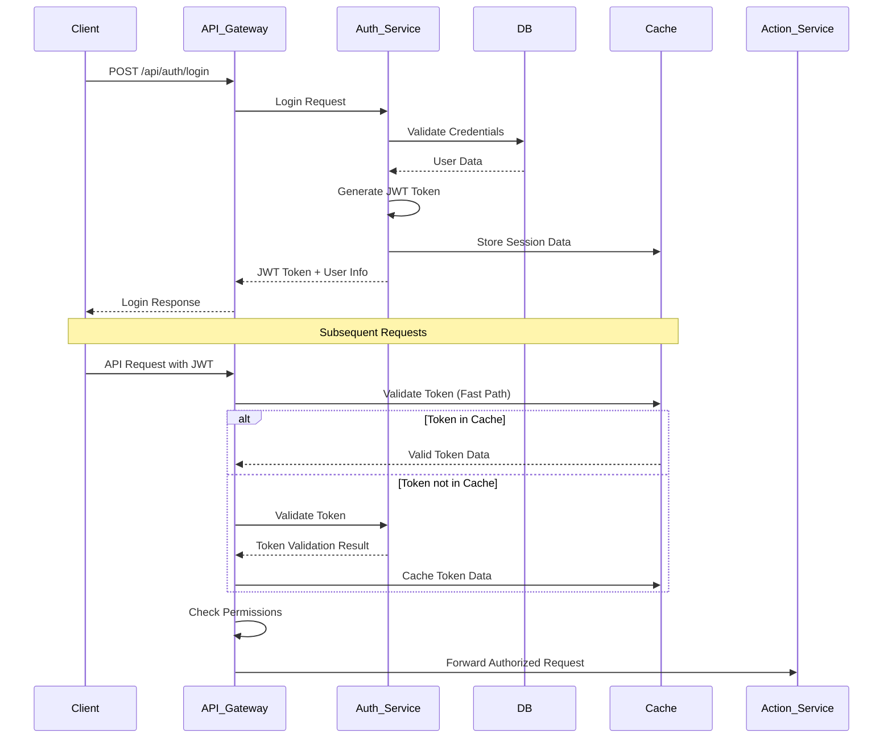
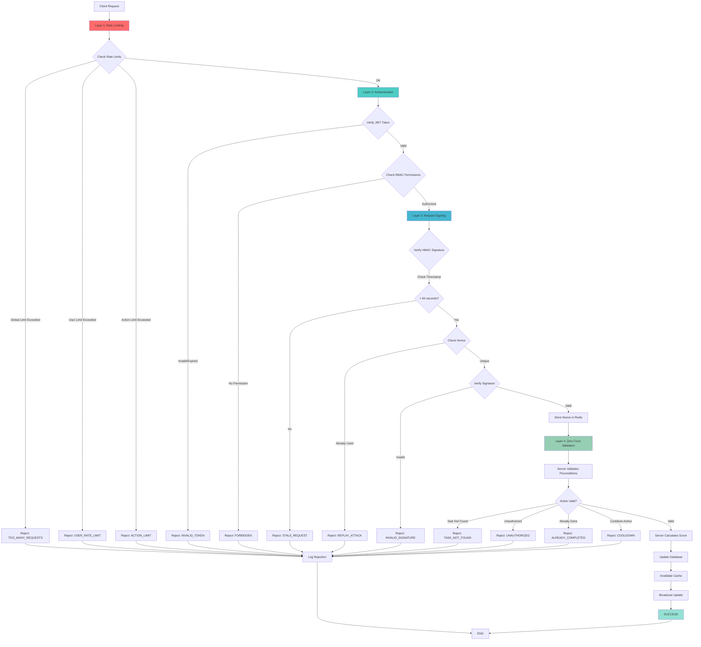
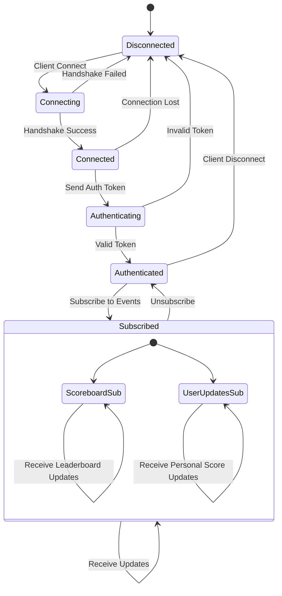
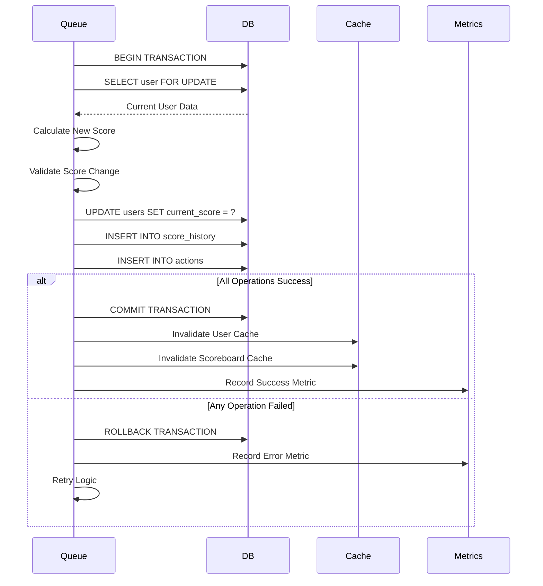
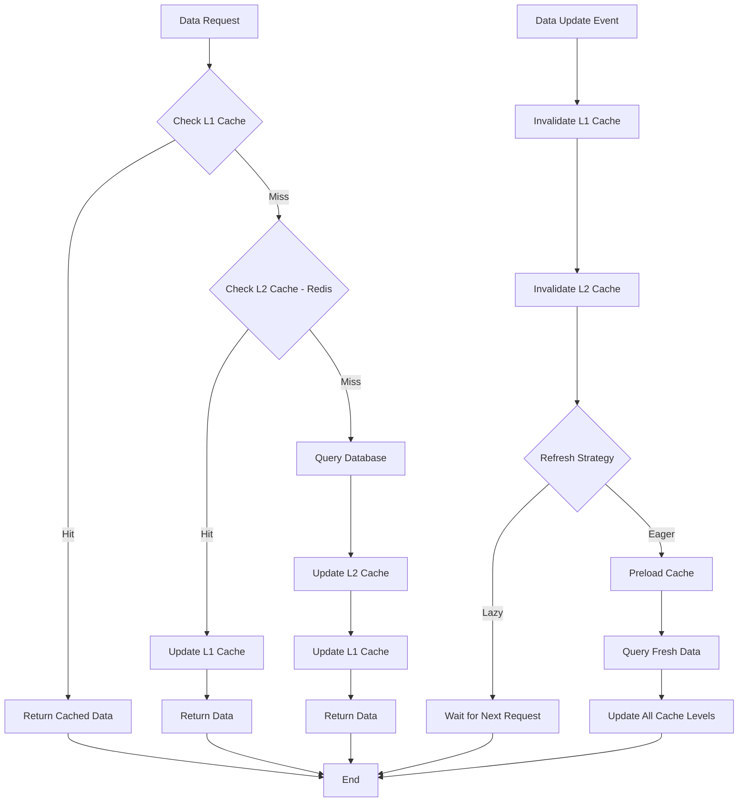
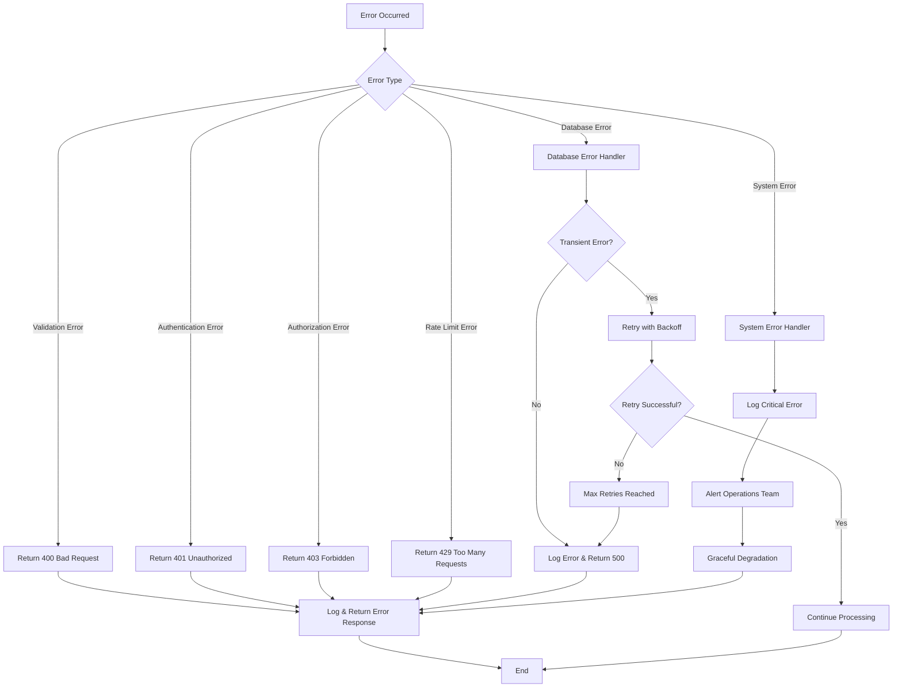
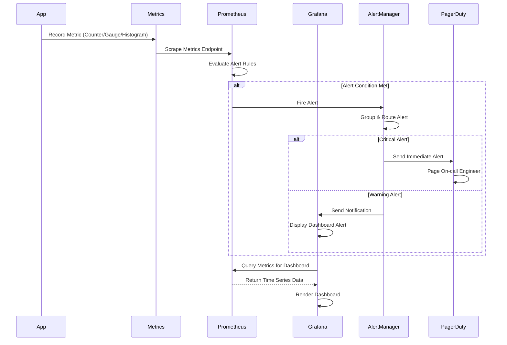
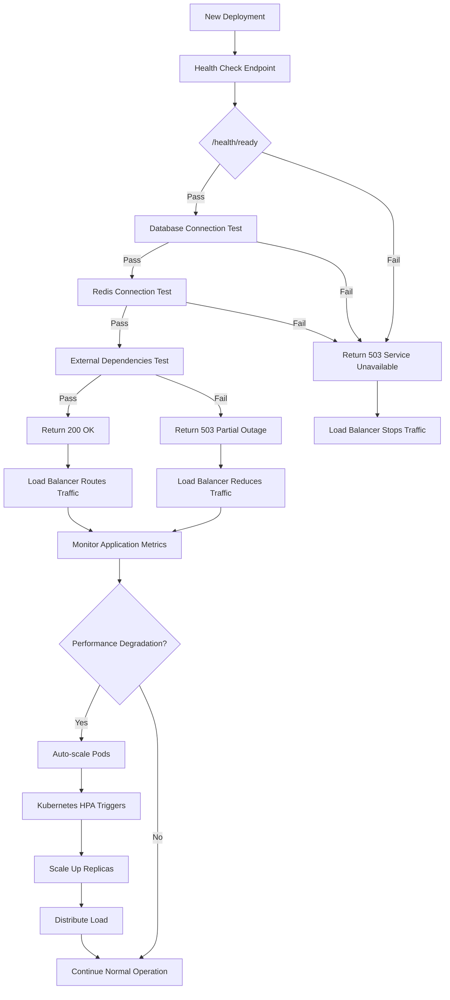

# Score Board System - Flow Diagrams

## 1. Main Action Processing Flow

## 2. Real-time Scoreboard Update Flow

## 3. Authentication and Authorization Flow

## 4. Security & Anti-fraud Flow (4 Layers)

## 5. WebSocket Connection Management Flow

## 6. Database Transaction Flow for Score Update

## 7. Cache Management Strategy Flow

## 8. Error Handling and Recovery Flow

## 9. Monitoring and Alerting Flow

## 10. Deployment and Health Checks Flow

## Summary of Main Flows

### 1. **Action Processing Flow**
- Client sends action → API Gateway → Authentication → Validation → Queue → Database → Cache Update → WebSocket Broadcast

### 2. **Real-time Updates**
- Score changes → Calculate new rank → Update cache → Broadcast via WebSocket

### 3. **Security & Anti-fraud (4 Layers)**
Defense in Depth with 4 protection layers:
1. **Layer 1 - Rate Limiting**: Multi-tier (Global, User, Action) to prevent spam and DDoS
2. **Layer 2 - Authentication**: JWT verification + RBAC permissions check
3. **Layer 3 - Request Signing**: HMAC signature with timestamp and nonce to prevent replay attacks
4. **Layer 4 - Zero-Trust Validation**: Server validates preconditions and calculates score

**11 rejection points** ensure no request can bypass security:
- Rate limits (3 types)
- Authentication (2 checks: token + permissions)
- Request signing (3 checks: timestamp + nonce + signature)
- Zero-trust validation (4 checks: task exists + authorized + not done + no cooldown)

### 4. **Error Handling**
- Comprehensive error categorization with appropriate HTTP status codes and retry mechanisms

### 5. **Performance Optimization**
- Multi-level caching strategy with intelligent invalidation and refresh policies

---

## 🎯 Key Security Points

**Defense in Depth**: Each request must pass through **4 layers** and **11 validation points**

**Fail Fast**: Reject as early as possible to save resources (Rate limiting → Authentication → Signing → Validation)

**Zero Trust**: Server doesn't trust any data from client, validates and calculates everything

**Comprehensive Logging**: All rejections are logged for analysis and improvement

These diagrams provide a detailed blueprint for the Backend team to implement each component of the system systematically and ensure consistency.
